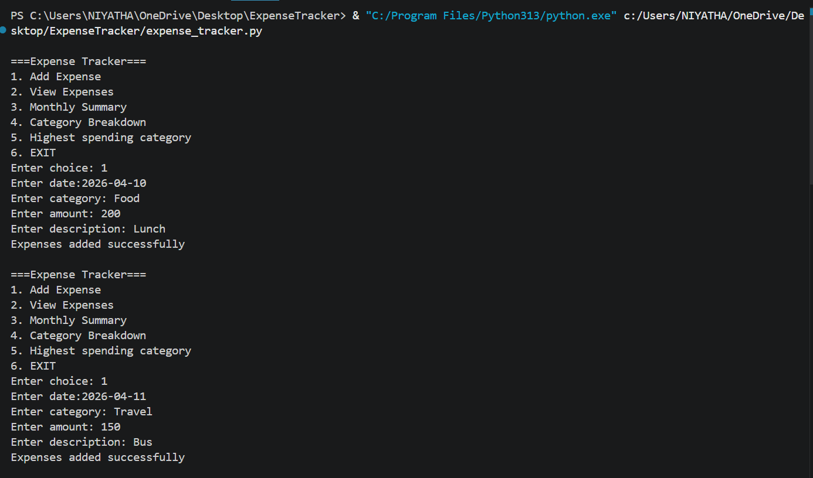
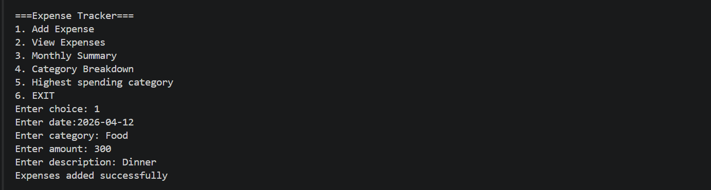
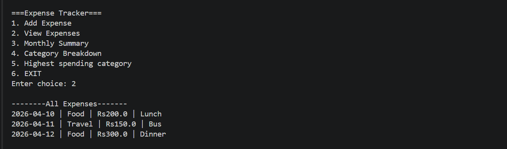
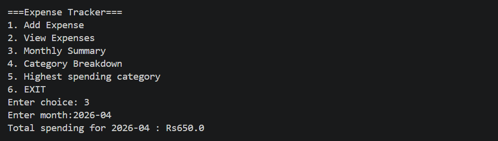
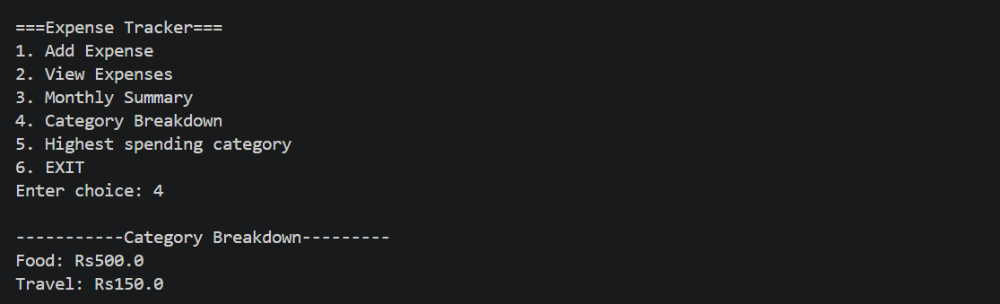
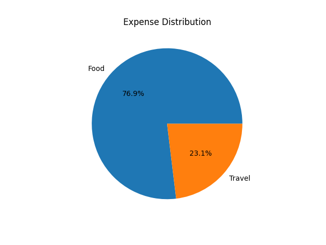
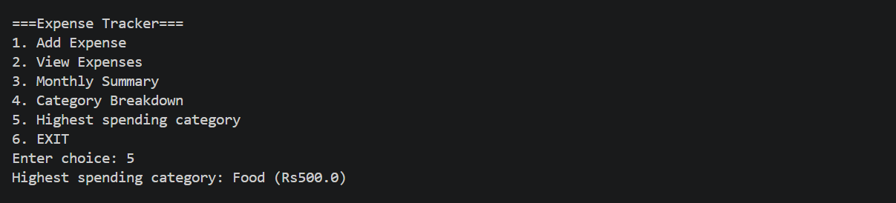
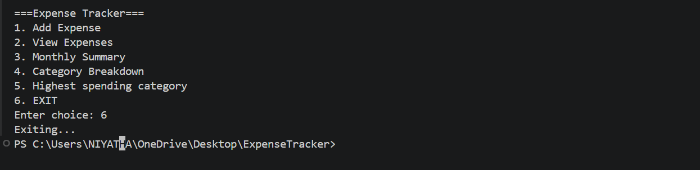

# Expense Tracker (Python)

## Features
- Add Expense
- View Expenses
- Monthly Expense Calculation
- Category-wise Breakdown
- Data stored using JSON
- Pie Chart Visualization

## Concepts Used
- Python Basics
- Lists & Dictionaries
- File Handling (JSON)
- Loops & Conditions
- Matplotlib (for visualization)

## How to Run
1. Install matplotlib:
   pip install matplotlib

2. Run the program:
   python expense_tracker.py

## Screenshots

### Add Expense

### View Expenses

### Monthly Summary

### Category Breakdown

### Category Breakdown (Pie Chart)

### Highest Spending Category

### Exit

